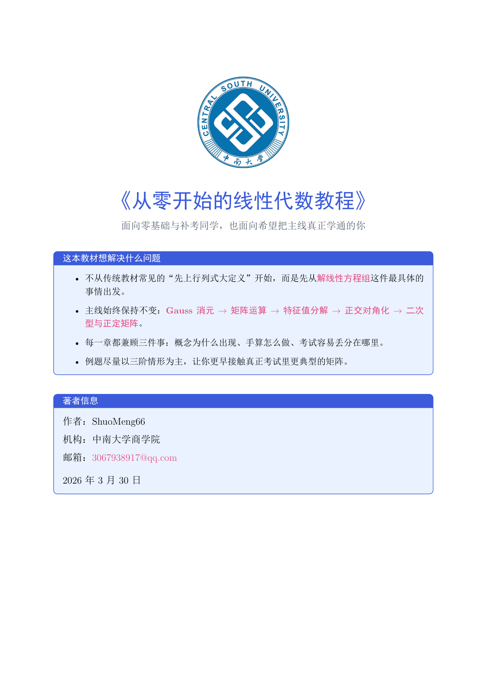

# 《从零开始的线性代数教程》

面向零基础、自学入门与补考复习的中文线性代数开源讲义。

这个项目尝试把线性代数从“定义堆叠”改写成一条更自然的学习主线：先解决线性方程组，再引出矩阵运算，随后过渡到特征值分解、正交对角化，最后收束到二次型与正定矩阵。整套内容使用 LaTeX 编写，并配套了一个贴合本教材主线的 Cherry Studio 教材助教。



## 快速入口

- 直接阅读讲义 PDF：[dist/from_zero_linear_algebra.pdf](dist/from_zero_linear_algebra.pdf)
- 查看 LaTeX 源码：[src/from_zero_linear_algebra.tex](src/from_zero_linear_algebra.tex)
- 导入 Cherry Studio 助教：[cherry-studio/assistants.json](cherry-studio/assistants.json)
- 查看教材助教 skill 说明：[skills/from-zero-linear-algebra-tutor/SKILL.md](skills/from-zero-linear-algebra-tutor/SKILL.md)
- 查看贡献规范：[CONTRIBUTING.md](CONTRIBUTING.md)
- 查看当前版本说明：[RELEASE_NOTES.md](RELEASE_NOTES.md)

仓库地址：

```bash
git@github.com:ShuoMeng66/Linear-Algebra.git
```

## 3 分钟快速开始

### 只想先读教材

直接打开：

```text
dist/from_zero_linear_algebra.pdf
```

### 想直接用教材助教

把这个订阅地址导入 Cherry Studio：

```text
https://raw.githubusercontent.com/ShuoMeng66/Linear-Algebra/main/cherry-studio/assistants.json
```

然后在助手列表中选择 `从零线代教材助教` 即可。

### 想在本地修改源码

```bash
git clone git@github.com:ShuoMeng66/Linear-Algebra.git
cd Linear-Algebra/src
xelatex -interaction=nonstopmode -halt-on-error from_zero_linear_algebra.tex
xelatex -interaction=nonstopmode -halt-on-error from_zero_linear_algebra.tex
```

## 这本教材想解决什么问题

- 不从传统教材常见的“先讲行列式”开始，而是从 Gauss 消元法和线性方程组切入。
- 强调章节之间的逻辑衔接，尽量减少“学完前一章却不知道下一章为什么出现”的割裂感。
- 例题以三阶矩阵为主，更贴近常见考试题型和手算训练。
- 内容同时照顾零基础和补考同学，重视“为什么这么做”“哪里最容易错”“怎么拿分”。
- 在版式与叙述中加入 MyGO!!!!! 角色陪学元素，降低阅读门槛。
- 额外提供 Cherry Studio 教材助教，不只会讲题，还能做证明步骤拆解、思路批改、卡壳引导、错题复盘与补考陪跑。

## 教材主线

本教材当前保留并强化的核心主线是：

```text
（齐次/非齐次）线性方程组的 Gauss 消元法（重点：齐次、rank）
-> 矩阵的基本运算（转置、求逆、行列式）
-> 矩阵的相似对角化（特征值分解）
-> 矩阵的合同对角化（正交矩阵）
-> 二次型（正定矩阵）
```

## 适合谁

- 正在补考，想快速建立主线和手算能力的同学
- 学过一遍但知识点碎片化，希望重新梳理逻辑的人
- 想把教材、讲义、AI 助教一起做成开源项目的人

## 当前版本亮点

- 五章主线已经统一收束，避免内容发散。
- 讲义中补入了更多典型三阶例题。
- 每章增加了更系统的课后练习，并按 `A / B / C` 分级。
- Cherry Studio 助教已经支持例题精讲、知识点细讲、证明题拆步、思路批改、卡壳提示和 OCR 文本整理。
- `README`、`CONTRIBUTING`、`LICENSE` 与 skill 说明已经同步对齐，适合继续开源迭代。

## 仓库结构

```text
.
├─ README.md
├─ RELEASE_NOTES.md
├─ LICENSE
├─ CONTRIBUTING.md
├─ THIRD_PARTY_ASSETS.md
├─ cherry-studio/
│  └─ assistants.json
├─ skills/
│  └─ from-zero-linear-algebra-tutor/
│     ├─ SKILL.md
│     └─ references/
├─ src/
│  └─ from_zero_linear_algebra.tex
├─ dist/
│  └─ from_zero_linear_algebra.pdf
└─ assets/
   └─ images/
```

各目录作用：

- `src/`：LaTeX 源码
- `dist/`：可直接阅读或发布的 PDF 成品
- `cherry-studio/`：可直接订阅的助手配置
- `skills/`：教材助教 skill 本体与参考资料
- `assets/`：封面、角色图与 README 预览图

## 讲义结构

1. 线性方程组与 Gauss 消元法  
   重点讲齐次方程组、秩、主变量与自由变量、基础解系、特解加齐次通解。
2. 矩阵的基本运算  
   从矩阵乘法、转置、逆矩阵讲到行列式，并解释它们为什么会在这一步出现。
3. 矩阵的相似对角化  
   用前两章的工具自然进入特征值、特征向量与相似对角化。
4. 矩阵的合同对角化  
   聚焦实对称矩阵与正交矩阵，说明它为何是二次型的直接入口。
5. 二次型与正定矩阵  
   统一二次型、顺序主子式、特征值与正定性判断。

## Cherry Studio 教材助教

这个助教不是泛用线性代数答题器，而是围绕这本教材本身服务的“伴学型助教”。

它比较适合做这些事：

- 讲义伴学：把书里的某个例题、定义、定理和方法按本书顺序重新讲一遍
- 证明拆步：你只卡在某一步时，单独解释那一步为什么成立
- 思路批改：你把自己的证明或计算发过去，让它帮你看哪里对、哪里缺逻辑
- 卡壳提示：你做到一半停住时，让它只给下一步，不直接把整题讲完
- 错题复盘：你连续几次做错同一类题时，让它总结薄弱点并补练习
- 补考陪跑：时间不多时，让它按“高频考点 + 常见丢分点 + 小练习”带你冲刺

### 零基础部署流程

#### 1. 安装 Cherry Studio

- 官方下载页：[Cherry Studio Download](https://docs.cherry-ai.com/en-us/cherrystudio/download)

#### 2. 准备模型服务

Cherry Studio 是客户端，真正负责回答的是你接入的模型。你可以把“模型”理解成讲题的大脑，把 “API Key / Token” 理解成使用凭证。

如果你是第一次接触，最推荐两条路线：

- 路线 A：先用 ModelScope
  - 文档：[Cherry Studio ModelScope](https://docs.cherry-ai.com/pre-basic/providers/modelscope)
  - 优点：不需要自己部署、上手快、对零基础同学最友好
- 路线 B：已有 API Key
  - 文档：[模型服务商配置](https://docs.cherry-ai.com/pre-basic/settings/providers)
  - 适合已经在用 OpenAI、Claude、Gemini 或 DeepSeek 的同学

补充提醒：

- 中国大陆用户使用 OpenAI 官方 API 往往还需要额外处理网络与支付问题。
- 如果只是为了稳定学习这本教材，没必要一开始就选最贵的模型。
- 如果海外模型连接超时，可以检查 Cherry Studio 的 `代理模式` 设置。

#### 3. 导入教材助教

- 助手订阅文档：[Assistants Subscribe](https://docs.cherry-ai.com/pre-basic/data-settings/assistants-subscribe)

导入步骤：

1. 打开 Cherry Studio
2. 进入设置
3. 找到“数据设置”或“助手订阅配置”
4. 新增一个订阅地址
5. 粘贴下方地址

```text
https://raw.githubusercontent.com/ShuoMeng66/Linear-Algebra/main/cherry-studio/assistants.json
```

6. 保存并刷新助手列表
7. 选择 `从零线代教材助教`

### 建议使用的模型

| 你的场景 | 建议模型 | 适合原因 |
| --- | --- | --- |
| 第一次试用、预算敏感 | `deepseek-chat` / `gpt-5-mini` | 速度快、成本低，讲基础概念和常规题通常已经够用 |
| 希望讲得更稳、更像老师带着你学 | `claude-sonnet-4-5` / `gemini-2.5-pro` | 更适合长篇解释、分步骤拆解和连续追问 |
| 卡在难题、压轴题、反复追问都想讲透 | `deepseek-reasoner` / `gpt-5` | 更适合多步推理、复杂例题和细致展开 |

官方模型资料：

- [OpenAI GPT-5 系列](https://platform.openai.com/docs/models/gpt-5)
- [OpenAI GPT-5 mini](https://platform.openai.com/docs/models/gpt-5-mini)
- [Anthropic Claude 模型总览](https://docs.anthropic.com/zh-CN/docs/about-claude/models/overview)
- [Google Gemini 2.5 Pro](https://ai.google.dev/gemini-api/docs/models/gemini-v2)
- [DeepSeek 模型与价格](https://api-docs.deepseek.com/zh-cn/quick_start/pricing)

最省事的选择顺序：

1. 完全没接触过 AI：先用 `ModelScope`
2. 想要性价比：优先试 `deepseek-chat`
3. 想要更强的难题讲解能力：再切到 `deepseek-reasoner`
4. 已经稳定使用 OpenAI / Claude / Gemini：再按自己习惯切更强模型

### 如何提问，效果最好

最推荐你给出这些信息：

- 章节名或节标题
- 题目原文
- 你已经做到哪一步
- 你最不确定的是哪一句或哪一个变形

如果模型不支持读图，也可以这样处理：

- 把矩阵按行打出来
- 把题目和已做步骤转成文字
- 用 LaTeX 输入关键公式
- 先用 OCR 把图片转成文本，再发给助教整理

示例提问：

- “请按《从零开始的线性代数教程》第一章例题精讲 2 的思路，详细解释基础解系为什么这样写，不要跳步。”
- “这是我写的证明，你帮我看是不是从第二步开始就不严密了，先沿我的思路改，不要直接换方法。”
- “我只做到增广矩阵化成阶梯形，后面不会写了。先别给完整答案，只告诉我下一步应该盯住什么。”
- “我在补考，麻烦你只按这本书第五章的主线，讲顺序主子式判别法怎么快速拿分。”

### 一个完整使用示例

```text
题目：
设 A 为三阶实对称矩阵，证明 A 可以正交对角化。

我的思路：
1. 因为 A 是实对称矩阵，所以它的特征值都是实数。
2. 所以 A 一定能对角化。
3. 因此存在正交矩阵 Q 使 Q^T A Q 为对角矩阵。

我不确定的地方：
第 2 步到第 3 步为什么能直接推出？

要求：
请先检查我的思路，不要直接给整段标准答案。先告诉我哪些地方是对的，哪里还缺东西。
```

一个好的回答通常会：

- 先肯定你已经抓对的部分
- 再指出第一处真正需要修补的地方
- 解释“实特征值”为什么还不够，为什么还需要正交特征向量组这层信息
- 尽量沿你的原思路往下修，而不是一上来整题重写
- 如有需要，再补成可交作业的更规范版本

## 本地编译

推荐使用 `XeLaTeX`：

```bash
cd src
xelatex -interaction=nonstopmode -halt-on-error from_zero_linear_algebra.tex
xelatex -interaction=nonstopmode -halt-on-error from_zero_linear_algebra.tex
```

编译后将生成的 PDF 覆盖到 `dist/` 即可：

```text
dist/from_zero_linear_algebra.pdf
```

## 设计与写作取向

- 以“问题驱动”替代“名词堆砌”
- 以“三阶典型例题”替代过于理想化的二维示例
- 以“对话解释 + 结构总结 + 关键习题”替代单线灌输式叙述
- 让每一章都能独立复习，同时又能嵌回整条主线

## 素材与版权说明

项目中使用了两类视觉素材：

- MyGO!!!!! 相关角色图与视觉图，用于讲义中的陪学叙述与版式增强
- 中南大学校徽图片，用于封面机构标识呈现

当前使用的图片来源包括：

- [MyGO!!!!! 官方动画站点](https://anime.bang-dream.com/mygo/)
- 用户提供的 `中南大学logo.rar` 压缩包

如果你准备将本项目进一步公开传播、二次出版或用于商业场景，建议先自行确认相关图片素材的版权与使用边界。更详细的素材说明见 [THIRD_PARTY_ASSETS.md](THIRD_PARTY_ASSETS.md)。

## 作者信息

- GitHub 用户名：`ShuoMeng66`
- 机构：中南大学商学院
- 邮箱：`3067938917@qq.com`

## 参与贡献

如果你想继续完善教材正文、课后习题或 Cherry Studio 教材助教，请先看：

- [CONTRIBUTING.md](CONTRIBUTING.md)
- [LICENSE](LICENSE)

## 后续可继续增强的方向

- 增加每章“从基础到压轴”的分层习题
- 补充更多三阶矩阵完整手算案例
- 增加英文摘要或双语说明，方便仓库对外展示
