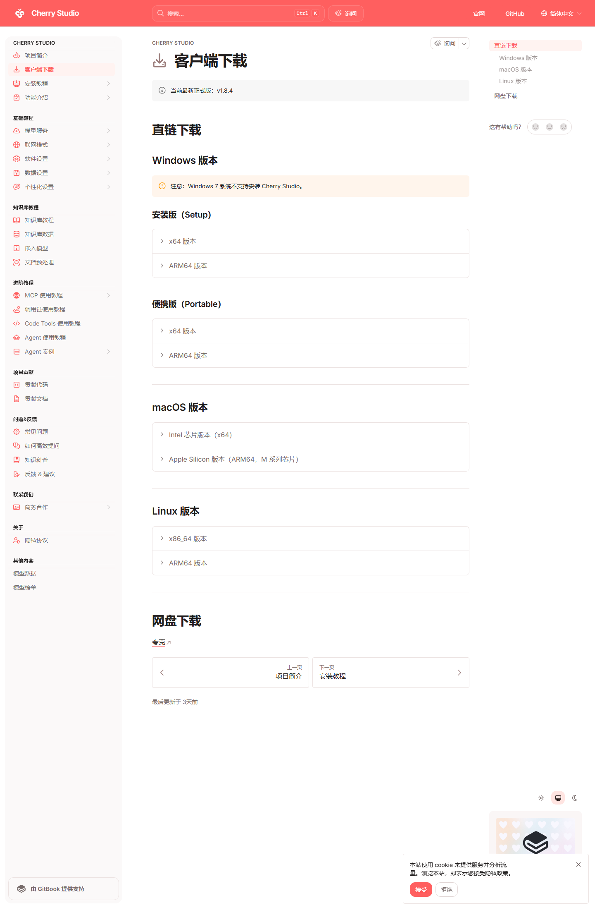

# 《从零开始的线性代数教程》

面向零基础、自学入门与补考复习的中文线性代数开源讲义。

这个项目尝试把线性代数从“定义堆叠”改写成一条更自然的学习主线：先解决线性方程组，再引出矩阵运算，随后过渡到特征值分解、正交对角化，最后收束到二次型与正定矩阵。整套内容使用 LaTeX 编写，并配套了 Cherry Studio 助手订阅配置、可手动部署的学习 Agent 提示词，以及围绕本书编写的教材助教 skill。


## 快速入口

- 直接阅读讲义 PDF：[dist/from_zero_linear_algebra.pdf](dist/from_zero_linear_algebra.pdf)
- 查看 LaTeX 源码：[src/from_zero_linear_algebra.tex](src/from_zero_linear_algebra.tex)
- 导入 Cherry Studio 助教：[cherry-studio/assistants.json](cherry-studio/assistants.json)
- 手动部署 Cherry Studio 学习 Agent：[cherry-studio/agent-deployment.md](cherry-studio/agent-deployment.md)
- 复制 Agent 提示词：[cherry-studio/linear-algebra-learning-agent.prompt.md](cherry-studio/linear-algebra-learning-agent.prompt.md)
- 查看教材助教 skill 说明：[skills/from-zero-linear-algebra-tutor/SKILL.md](skills/from-zero-linear-algebra-tutor/SKILL.md)
- 运行内容校验脚本：[scripts/validate_content.py](scripts/validate_content.py)
- 查看贡献规范：[CONTRIBUTING.md](CONTRIBUTING.md)
- 查看当前版本说明：[RELEASE_NOTES.md](RELEASE_NOTES.md)

仓库地址：

```bash
git@github.com:ShuoMeng66/Linear-Algebra.git
```

## 3 分钟快速开始

### 只想先读教材

直接打开：

```text
dist/from_zero_linear_algebra.pdf
```

### 想直接用教材助教

把这个订阅地址导入 Cherry Studio：

```text
https://raw.githubusercontent.com/ShuoMeng66/Linear-Algebra/main/cherry-studio/assistants.json
```

然后在助手列表中选择 `从零线代教材助教` 即可。

### 想手动创建学习 Agent

直接按这个文档一步步填：

```text
cherry-studio/agent-deployment.md
```

真正粘贴进 Cherry Studio `添加 Agent` 窗口里的提示词在这里：

```text
cherry-studio/linear-algebra-learning-agent.prompt.md
```

### 想在本地修改源码

```bash
git clone git@github.com:ShuoMeng66/Linear-Algebra.git
cd Linear-Algebra/src
xelatex -interaction=nonstopmode -halt-on-error from_zero_linear_algebra.tex
xelatex -interaction=nonstopmode -halt-on-error from_zero_linear_algebra.tex
```

## 这本教材想解决什么问题

- 不从传统教材常见的“先讲行列式”开始，而是从 Gauss 消元法和线性方程组切入。
- 强调章节之间的逻辑衔接，尽量减少“学完前一章却不知道下一章为什么出现”的割裂感。
- 例题以三阶矩阵为主，更贴近常见考试题型和手算训练。
- 内容同时照顾零基础和补考同学，重视“为什么这么做”“哪里最容易错”“怎么拿分”。
- 在版式与叙述中加入 MyGO!!!!! 角色陪学元素，降低阅读门槛。
- 额外提供 Cherry Studio 教材助教，不只会讲题，还能做证明步骤拆解、思路批改、卡壳引导、错题复盘与补考陪跑。

## 教材主线

本教材当前保留并强化的核心主线是：

```text
（齐次/非齐次）线性方程组的 Gauss 消元法（重点：齐次、rank）
-> 矩阵的基本运算（转置、求逆、行列式）
-> 矩阵的相似对角化（特征值分解）
-> 矩阵的合同对角化（正交矩阵）
-> 二次型（正定矩阵）
```

## 适合谁

- 正在补考，想快速建立主线和手算能力的同学
- 学过一遍但知识点碎片化，希望重新梳理逻辑的人
- 想把教材、讲义、AI 助教一起做成开源项目的人

## 当前版本亮点

- 五章主线已经统一收束，避免内容发散。
- 修正了讲义里已核对出的数学错误，尤其是第 1 章两处习题答案提示错误。
- 讲义中补入了更多典型三阶例题，并新增了每章的选择 / 填空快练与速判技巧。
- 每章增加了更系统的课后练习，并按 `A / B / C` 分级。
- Cherry Studio 现在同时提供“助手订阅”和“手动创建学习 Agent”两条部署路线。
- 新增 `scripts/validate_content.py`，可用 `sympy` 一键复核例题、参数题和关键答案提示。
- `README`、`CONTRIBUTING`、`LICENSE` 与 skill 说明已经同步对齐，适合继续开源迭代。

## 仓库结构

```text
.
├─ README.md
├─ RELEASE_NOTES.md
├─ LICENSE
├─ CONTRIBUTING.md
├─ THIRD_PARTY_ASSETS.md
├─ cherry-studio/
│  ├─ assistants.json
│  ├─ agent-deployment.md
│  └─ linear-algebra-learning-agent.prompt.md
├─ skills/
│  └─ from-zero-linear-algebra-tutor/
│     ├─ SKILL.md
│     └─ references/
├─ scripts/
│  └─ validate_content.py
├─ src/
│  └─ from_zero_linear_algebra.tex
├─ dist/
│  └─ from_zero_linear_algebra.pdf
└─ assets/
   └─ images/
```

各目录作用：

- `src/`：LaTeX 源码
- `dist/`：可直接阅读或发布的 PDF 成品
- `cherry-studio/`：Cherry Studio 助手订阅配置、学习 Agent 提示词与手动部署说明
- `skills/`：教材助教 skill 本体与参考资料
- `scripts/`：用于校验讲义内容与答案提示的脚本
- `assets/`：封面、角色图与 README 预览图

## 讲义结构

1. 线性方程组与 Gauss 消元法  
   重点讲齐次方程组、秩、主变量与自由变量、基础解系、特解加齐次通解。
2. 矩阵的基本运算  
   从矩阵乘法、转置、逆矩阵讲到行列式，并解释它们为什么会在这一步出现。
3. 矩阵的相似对角化  
   用前两章的工具自然进入特征值、特征向量与相似对角化。
4. 矩阵的合同对角化  
   聚焦实对称矩阵与正交矩阵，说明它为何是二次型的直接入口。
5. 二次型与正定矩阵  
   统一二次型、顺序主子式、特征值与正定性判断。

## Cherry Studio 助手 / Agent

这个项目现在给了两条 Cherry Studio 路线：

- 路线 A：直接导入 `assistants.json`，用现成的教材助教或学习 Agent
- 路线 B：按 `智能体 -> 添加 Agent` 手动创建一个更适合长期陪学的线代学习 Agent

它们都不是泛用线性代数答题器，而是围绕这本教材本身服务的“伴学型配置”。

它比较适合做这些事：

- 讲义伴学：把书里的某个例题、定义、定理和方法按本书顺序重新讲一遍
- 证明拆步：你只卡在某一步时，单独解释那一步为什么成立
- 思路批改：你把自己的证明或计算发过去，让它帮你看哪里对、哪里缺逻辑
- 卡壳提示：你做到一半停住时，让它只给下一步，不直接把整题讲完
- 错题复盘：你连续几次做错同一类题时，让它总结薄弱点并补练习
- 补考陪跑：时间不多时，让它按“高频考点 + 常见丢分点 + 小练习”带你冲刺

### 零基础部署流程

#### 1. 安装 Cherry Studio

- 官方客户端下载页：[Cherry Studio 客户端下载](https://docs.cherry-ai.com/cherry-studio/download)

截至 `2026-04-03`，我核对官网客户端下载页时，页面显示当前官方版本为 `v1.8.4`。后续如果版本更新，请以下载页实时显示为准。

大多数 Windows 同学直接点：

- `Windows 版本` -> `安装版 (Setup)` -> `x64 版本`

只有在你明确知道自己用的是 `ARM` 设备时，再去选 `ARM64`。



上图可以直接看到官网把 `Windows / macOS / Linux` 的下载入口分开列出来了；对大多数使用普通 Windows 笔记本或台式机的同学来说，直接下载 `Windows x64 安装版` 就可以。

#### 2. 准备模型服务

Cherry Studio 是客户端，真正负责回答的是你接入的模型。可以把“模型”理解成讲题的大脑，把 `API Key / Token` 理解成使用凭证。

如果是第一次接触，最推荐两条路线：

- 路线 A：先用阿里云百炼
  - 文档：[Cherry Studio 阿里云百炼](https://docs.cherry-ai.com/pre-basic/providers/a-li-yun-bai-lian)
  - 推荐先试：百炼中带免费额度或低门槛的 `Qwen` 系列，例如 `qwen3.5-flash`、`qwen3-30b-a3b` 等
  - 优点：国内接入更顺、配置路径清楚、对零基础同学更友好
- 路线 B：已有其他 API Key
  - 文档：[模型服务商配置](https://docs.cherry-ai.com/pre-basic/settings/providers)
  - 适合已经在用 DeepSeek、Gemini、OpenAI、Claude 等模型的同学

补充提醒：

- 如果主要是配合这本教材学习基础概念、例题和课后习题，优先从百炼里的 `Qwen` 免费路线开始通常就够用了。
- 中国大陆用户使用 OpenAI 官方 API 往往还需要额外处理网络与支付问题。
- 如果只是为了稳定学习这本教材，没必要一开始就选最贵的模型。
- 如果海外模型连接超时，可以检查 Cherry Studio 的 `代理模式` 设置。

如果你想走你截图里的 `添加 Agent` 这条路线，还要额外注意一件事：

- 官方文档：[Cherry Studio Agent](https://docs.cherry-ai.com/advanced-basic/agent)
- Cherry Studio 官方 Agent 文档提到，`Agent` 功能从 `v1.7.0.alpha` 开始支持，当前走的是 `Anthropic` 接口路线；如果你手动配服务商，`Base URL` 需要以 `/v1/` 结尾。

也就是说：

- 只是导入本仓库里的助手订阅：常规模型服务商就可以
- 想手动创建 `Agent`：优先确认你已经把对应的 Agent 模型接口接好了

#### 3. 导入教材助教 / 学习助手

- 官方文档里仍能看到“助手订阅配置”相关页面：[Assistants Subscribe](https://docs.cherry-ai.com/pre-basic/data-settings/assistants-subscribe)

但当前版本 Cherry Studio 的实际导入入口不在 `设置 -> 数据设置` 中。

可按下面这条路径导入：

1. 打开 Cherry Studio
2. 点击顶部的 `智能体`
3. 如果第一次打开这里，页面会提示“请启用 API 服务器以使用智能体功能”，先点 `启用并启动`
4. 回到顶部，点击 `+`
5. 进入 `助手库`
6. 在助手库页面点击 `从外部导入`
7. 在弹窗下半部分找到 `助手 -> 添加订阅 -> 订阅源地址`
8. 粘贴下方订阅地址并点击 `订阅`

```text
https://raw.githubusercontent.com/ShuoMeng66/Linear-Algebra/main/cherry-studio/assistants.json
```

订阅成功后，左侧通常会出现 `教育 / 线性代数 / 教材伴学` 等分类。当前订阅里已经放了两个可直接用的配置：

- `从零线代教材助教`
- `从零线代学习 Agent`

确定订阅成功后，可在 Cherry Studio 的 `知识库` 中创建知识库并上传本书的 PDF，这样助手在解释例题、知识点和证明步骤时会更贴近教材原文。

#### 4. 手动创建学习 Agent（对应 `智能体 -> 添加 Agent`）

如果你更想按自己截图里的界面手动配置，而不是直接订阅，可按下面这套最稳的填法：

1. 打开 Cherry Studio，进入 `智能体`
2. 点击 `添加 Agent`
3. 名称推荐填：`从零线代学习 Agent`
4. 模型：选择你当前已经接好的、讲题比较稳的模型
5. `Git Bash`：优先用自动发现；如果没有，再手动选择你本机的 `bash.exe`
6. `权限模式`：优先选 `普通模式`；如果你的版本里有 `计划模式`，也可以选它，但不要开 `全自动模式`
7. 把下面这个文件里的内容完整复制进提示词区域：

```text
cherry-studio/linear-algebra-learning-agent.prompt.md
```

如果你想少走弯路，也可以直接打开这份说明照着填：

```text
cherry-studio/agent-deployment.md
```

这套手动 Agent 配置更强调三件事：

- 语言不生硬，适合补考和初学者
- 计算、参数分类、选择填空会先做自检
- 会优先按“讲懂 -> 批改 -> 提示 -> 补练习”的学习流程来陪跑

关于权限模式，再单独提醒一句：

- 这个 Agent 的主要用途是帮助读者学习，不是替你在本地环境里大范围执行命令
- 所以只建议开 `普通模式`，或者在你明确知道自己需要时开 `计划模式`
- **不要开启 `全自动模式`**，因为这会带来不必要的安全风险

### 建议使用的模型

| 你的场景 | 建议模型 | 适合原因 |
| --- | --- | --- |
| 第一次试用、完全零基础 | `qwen3.5-flash` / `qwen3-30b-a3b` | 在阿里云百炼中更容易接入，起步成本低，讲教材主线、基础概念和常规题通常已经够用 |
| 希望长期稳定使用、讲解更细一点 | `qwen3.5-plus` | 仍然是 `Qwen` 路线，解释更稳，适合连续追问、例题精讲和知识点细化 |
| 卡在难题、综合题、长证明题 | `deepseek-reasoner` / `gemini-2.5-pro` | 更适合多步推理、复杂例题、长链条证明和反复追问 |
| 已经有自己的海外模型使用习惯 | `deepseek-chat` / `gemini-2.5-flash` / `gpt-5-mini` | 可以直接沿用现有服务商配置，不需要重新适应工作流 |

官方模型资料：

- [阿里云百炼平台](https://bailian.console.aliyun.com)
- [阿里云百炼模型列表与价格](https://help.aliyun.com/zh/model-studio/model-pricing)
- [Cherry Studio 阿里云百炼接入说明](https://docs.cherry-ai.com/pre-basic/providers/a-li-yun-bai-lian)
- [Google Gemini 2.5 Pro](https://ai.google.dev/gemini-api/docs/models/gemini-v2)
- [DeepSeek 模型与价格](https://api-docs.deepseek.com/zh-cn/quick_start/pricing)
- [OpenAI GPT-5 mini](https://platform.openai.com/docs/models/gpt-5-mini)

最省事的选择顺序：

1. 完全没接触过 AI：先在 Cherry Studio 里接入 `阿里云百炼`
2. 第一次使用教材助教：优先试百炼中带免费额度的 `Qwen` 模型，例如 `qwen3.5-flash`
3. 如果基础题能讲明白，但想要更稳的细讲能力：再升级到 `qwen3.5-plus`
4. 如果开始频繁处理长证明题、综合题、压轴题：再考虑 `deepseek-reasoner` 或 `gemini-2.5-pro`
5. 已经稳定使用其他服务商：再按自己的账户和预算切换到更熟悉的模型

### 如何提问，效果最好

最推荐你给出这些信息：

- 章节名或节标题
- 题目原文
- 你已经做到哪一步
- 你最不确定的是哪一句或哪一个变形

如果模型不支持读图，也可以这样处理：

- 把矩阵按行打出来
- 把题目和已做步骤转成文字
- 用 LaTeX 输入关键公式
- 先用 OCR 把图片转成文本，再发给助教整理

示例提问：

- “请按《从零开始的线性代数教程》第一章例题精讲 2 的思路，详细解释基础解系为什么这样写，不要跳步。”
- “这是我写的证明，你帮我看是不是从第二步开始就不严密了，先沿我的思路改，不要直接换方法。”
- “我只做到增广矩阵化成阶梯形，后面不会写了。先别给完整答案，只告诉我下一步应该盯住什么。”
- “我在补考，麻烦你只按这本书第五章的主线，讲顺序主子式判别法怎么快速拿分。”
- “这道选择题请先告诉我速判思路，再给答案，不要只报字母。”
- “这道参数题你先帮我判断哪几种情形，再一类一类验，不要直接跳结论。”

### 一个完整使用示例

```text
题目：
设 A 为三阶实对称矩阵，证明 A 可以正交对角化。

我的思路：
1. 因为 A 是实对称矩阵，所以它的特征值都是实数。
2. 所以 A 一定能对角化。
3. 因此存在正交矩阵 Q 使 Q^T A Q 为对角矩阵。

我不确定的地方：
第 2 步到第 3 步为什么能直接推出？

要求：
请先检查我的思路，不要直接给整段标准答案。先告诉我哪些地方是对的，哪里还缺东西。
```

一个好的回答通常会：

- 先肯定你已经抓对的部分
- 再指出第一处真正需要修补的地方
- 解释“实特征值”为什么还不够，为什么还需要正交特征向量组这层信息
- 尽量沿你的原思路往下修，而不是一上来整题重写
- 如有需要，再补成可交作业的更规范版本

## 本地编译

推荐使用 `XeLaTeX`：

```bash
cd src
xelatex -interaction=nonstopmode -halt-on-error from_zero_linear_algebra.tex
xelatex -interaction=nonstopmode -halt-on-error from_zero_linear_algebra.tex
```

如果你想先把本次改动里最关键的例题、参数题和答案提示跑一遍校验，可先执行：

```bash
python scripts/validate_content.py
```

编译后将生成的 PDF 覆盖到 `dist/` 即可：

```text
dist/from_zero_linear_algebra.pdf
```

## 设计与写作取向

- 以“问题驱动”替代“名词堆砌”
- 以“三阶典型例题”替代过于理想化的二维示例
- 以“对话解释 + 结构总结 + 关键习题”替代单线灌输式叙述
- 让每一章都能独立复习，同时又能嵌回整条主线

## 素材与版权说明

项目中使用了两类视觉素材：

- MyGO!!!!! 相关角色图与视觉图，用于讲义中的陪学叙述与版式增强
- 中南大学校徽图片，用于封面机构标识呈现

当前使用的图片来源包括：

- [MyGO!!!!! 官方动画站点](https://anime.bang-dream.com/mygo/)
- 用户提供的 `中南大学logo.rar` 压缩包

如果你准备将本项目进一步公开传播、二次出版或用于商业场景，建议先自行确认相关图片素材的版权与使用边界。更详细的素材说明见 [THIRD_PARTY_ASSETS.md](THIRD_PARTY_ASSETS.md)。

## 作者信息

- GitHub 用户名：`ShuoMeng66`
- 机构：中南大学商学院
- 邮箱：`3067938917@qq.com`

## 参与贡献

如果你想继续完善教材正文、课后习题或 Cherry Studio 教材助教，请先看：

- [CONTRIBUTING.md](CONTRIBUTING.md)
- [LICENSE](LICENSE)

## 后续可继续增强的方向

- 增加每章“从基础到压轴”的分层习题
- 补充更多三阶矩阵完整手算案例
- 增加英文摘要或双语说明，方便仓库对外展示
